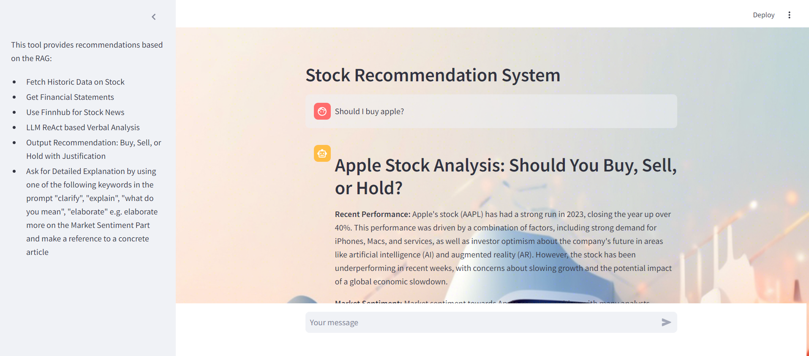

# LLM Stock Recommendation Agent

## Introduction

The **LLM Stock Recommendation Agent** is an innovative project aiming to leverage the power of Large Language Models (LLMs) to provide users with data-driven stock market recommendations. This application is designed to gather information from various financial sources, process it, and generate insightful recommendations.

## Technical Implementation

The LLM-based app is built using **Python** with the **Langchain** and **Streamlit** libraries.

* **Langchain** is utilized for constructing the LLM agent, enabling it to retrieve data from various sources and generate responses based on user prompts.
* **Streamlit** provides an intuitive framework for the user interface, allowing for interactive components, side panels, and background images.
* The **`gemini-1.5-flash`** model powers the LLM agent, chosen for its generous request limits, crucial for processing multiple data sources per interaction. The model's temperature is set to 0 for deterministic output, though results may vary slightly due to real-time data fluctuations.

### Langchain Core Functions

The LLM agent leverages three core functions to gather data and formulate recommendations:

* **`get_financial_statements(ticker)`**: Retrieves the last three financial statements of a given company using the `yfinance` library.
* **`get_stock_price(ticker)`**: Fetches historical stock prices for the last year of a given company, also via the `yfinance` library.
* **`get_recent_stock_news(ticker)`**: Retrieves recent news summaries and metadata related to a company's stock, utilizing the `Finnhub` API.

A detailed prompt template guides the agent's response generation. The agent employs a "thought" mechanism, systematically gathering data from these functions before forming its buy/hold/sell recommendation.

The final output adheres to a predefined structure (see Appendix). A key feature allows users to request further elaboration on specific sections of the response, providing more in-depth information and referencing source articles.

The article referenced for this analysis is titled *`"Can Amazon Stay Ahead of PDD's Temu and Shein in 2024?"`* which can be found online [here](https://www.fool.com/investing/2023/12/30/can-amazon-stay-ahead-of-pdds-temu-and-shein-in-20/). This enables the agent to maintain context and provide detailed clarifications.

### Validation

The agent generally provides well-reasoned recommendations and explanations, accurately reflecting historical stock prices and financial report data. However, a more comprehensive validation, including backtesting the recommendations against actual market performance, would be a valuable next step beyond the scope of this initial project. The agent's design encourages users to approach its recommendations with caution and critical consideration.

### User Interface

The user interface is built with the Streamlit library, providing an interactive web application experience.



## Requirements

Please refer to `requirements.txt` for a list of necessary packages and libraries.

### Setup Instructions

1.  **Set Your Google API Key:**
    -   Replace the following line in your code:
        ```python
        os.environ["GOOGLE_API_KEY"] = ''
        ```
    -   Insert your actual Google AI Studio API key in place of the empty quotes.

2.  **Set Your Finnhub API Key:**
    -   Locate the `get_recent_stock_news` function in your code.
    -   Replace the variable `api_key` with your actual Finnhub API key:
        ```python
        api_key = 'your_finhub_api_key'
        ```
    -   You can obtain a free Finnhub API key [here](https://finnhub.io/), if you don't already have one.

3.  **Launch the LLM App:**
    -   Use the following command to run the application and open the user interface in your web browser:
        ```bash
        streamlit run c:/Users/.../stock_recommender.py
        ```
    -   Make sure to replace the path with the correct location of `stock_recommender.py` on your machine.

### Additional Notes

* Ensure you have all required dependencies installed as listed in `requirements.txt`.
* If you encounter any issues, feel free to reach out for help.

## Conclusion

In this project, I created a functional implementation of the LLM agent, complete with a user interface that I briefly tested. However, further validation of the agent's recommendations is necessary; for instance, backtesting these recommendations against actual price movements would be beneficial. Nevertheless, the agent encourages users to approach its recommendations with caution and consideration.

## References

* Mibrix. *GitHub Repository: Project LLM*. [https://github.com/mibrix/Project_LLM](https://github.com/mibrix/Project_LLM)
* Finnhub. *Market News API*. [https://finnhub.io/docs/api/market-news](https://finnhub.io/docs/api/market-news)
* Streamlit. *Streamlit: The fastest way to build and share data apps*. [https://streamlit.io/](https://streamlit.io/)
* Langchain. *Langchain Documentation*. [https://python.langchain.com/docs/concepts/#react-agents](https://python.langchain.com/docs/concepts/#react-agents)
* Anasim1. *LLM Based Stock Recommendation System*. [https://github.com/anasim1/llm_based_stock_recommendation_system](https://github.com/anasim1/llm_based_stock_recommendation_system)
* Ethics Canvas. *Ethics Canvas*. [https://www.ethicscanvas.org/](https://www.ethicscanvas.org/)
* Fool.com. *Can Amazon Stay Ahead of PDD's Temu and Shein in 2024?* [https://www.fool.com/investing/2023/12/30/can-amazon-stay-ahead-of-pdds-temu-and-shein-in-20/](https://www.fool.com/investing/2023/12/30/can-amazon-stay-ahead-of-pdds-temu-and-shein-in-20/)

## Appendix
